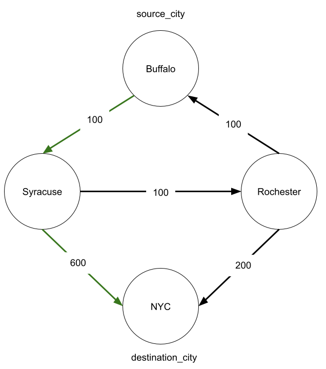
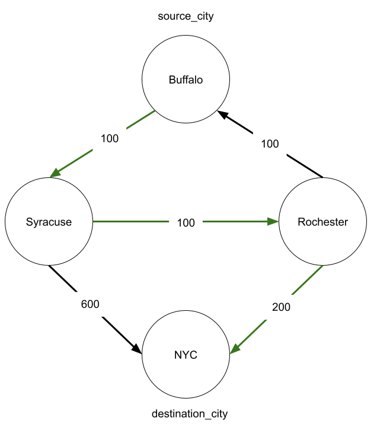
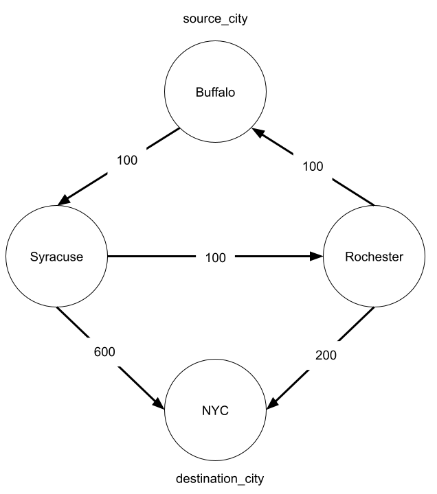

# Cheapest Flight Live Code

This repository is the classroom activity for the Graphs Pt. 1 Roundtable in Unit 4.

## Learning Goals 
- Practice converting a list of edges into an adjacency list.
  
## One-Time Activity Setup

Follow these directions once, at the beginning of the activity:


1. Navigate to the folder where you wish to save activities. This could be your `projects` folder, or you may want to create a new folder for all of your activities.

   If you followed Ada's recommended file system structure, you can navigate to your projects folder with the following command:

   ```bash
   $ cd ~/Developer/projects
   ```

   Or, if you want to create a new folder for all of your activities:

   ```bash
   $ cd ~/Developer
   $ mkdir activities
   $ cd activities
   ```

   If you've already created an activities directory, you can navigate to it with the following command:

   ```bash
   $ cd ~/Developer/activities
   ```

2. In Github click on the "Fork" button to fork the repository to your Github account.  This will make a copy of the activity in your Github account. 

3. "Clone" the activity into your working folder. This command makes a new folder named for the activity repository, and then puts the activity into this new folder.

   ```bash
   $ git clone <clone_url_for_the_activity>
   ```

   The `<>` syntax indicates a placeholder. You should replace `<clone_url_for_the_activity>` with the actual URL you'd use to clone this repository. If you click the green "Code" button on the GitHub page for this repository, you'll see a URL that you can copy to your clipboard.
 
   Use `ls` to confirm there's a new activity folder

4. Move your location into this activity folder

   ```bash
   $ cd <repository_directory>
   ```

   The `<repository_directory>` placeholder should be replaced with the name of the activity folder. If you're not sure what the folder is named, remember that you can use `ls` to list the contents of your current location.

5. Create a virtual environment named `venv` for this activity:

   ```bash
   $ python3 -m venv venv
   ```

6. Activate this environment:

   ```bash
   $ source venv/bin/activate
   ```

   Verify that you're in a python3 virtual environment by running:
   
   - `$ python --version` should output a Python 3 version
   - `$ pip --version` should output that it is working with Python 3

7. Install dependencies once at the beginning of this activity with

   ```bash
   # Must be in activated virtual environment
   $ pip install -r requirements.txt
   ```

   Not all activities will have dependencies, but there will still be an included `requirements.txt` file.

Summary of one-time activity setup:
- [ ] Fork the activity repository
- [ ] `cd` into your working folder, such as your `projects` or `activities` folder
- [ ] Clone the activity onto your machine
- [ ] `cd` into the folder for the activity
- [ ] Create the virtual environment `venv`
- [ ] Activate the virtual environment `venv`
- [ ] Install the dependencies with `pip`

## Activity Development Workflow

1. When working on this activity, always ensure that your virtual environment is activated:

   ```bash
   $ source venv/bin/activate
   ```

2. If you want to work on another project from the same terminal window, you should deactivate the virtual environment when you are done working on the activity:

   ```bash
   $ deactivate
   ```

# Cheapest Flight with Limited Layovers

## Problem Statement
Ada Airlines offers some number of flights connecting 'n' cities. They have a list of all of their flights `flights` where each item in the list `[departure_city, arrival_city, price]` represents a flight from `departure_city` to `arrival_city` that costs `price`. 

Provided with the list of `flights` Ada Airlines currently offers, the overall number of cities they fly to `cities`,  a customer's `source_city`, `destination_city`, and an integer `max_layovers`, return the price of Ada's cheapest route between the `source_city` and `destination_city` that has at most `max_layovers` layovers. 

The source and destination city do not count as a layover. If there is no route between the two cities, return -1. Ada Airlines only offers one flight between any two cities. 


## Examples

**Example 1**

**Input**
```
cites = 4
flights = [
    ['Buffalo', 'Syracuse', 100],
    ['Syracuse', 'NYC', 600],
    ['Rochester', 'Buffalo', 100],
    ['Rochester', 'NYC', 200],
    ['Syracuse', 'Rochester', 100]
]
source_city = 'Buffalo'
destination_city = 'NYC'
max_layovers = 1
```
**Output**
```
700
```

**Example 2**

**Input**
```
cites = 4
flights = [
    ['Buffalo', 'Syracuse', 100],
    ['Syracuse', 'NYC', 600],
    ['Rochester', 'Buffalo', 100],
    ['Rochester', 'NYC', 200],
    ['Syracuse', 'Rochester', 100]
]
source_city = 'Buffalo'
destination_city = 'NYC'
max_layovers = 3
```
**Output**
```
400
```

**Example 3**

**Input**
```
cites = 4
flights = [
    ['Buffalo', 'Syracuse', 100],
    ['Syracuse', 'NYC', 600],
    ['Rochester', 'Buffalo', 100],
    ['Rochester', 'NYC', 200],
    ['Syracuse', 'Rochester', 100]
]
source_city = 'Buffalo'
destination_city = 'NYC'
max_layovers = 0
```

**Output**
```
-1
```

### Sources
Adapted from: [Cheapest Flights Within K stops](https://leetcode.com/problems/cheapest-flights-within-k-stops/)
    
  
## Running Tests
Use the tests provided in the `test_cheapest_flight.py` file to verify that your code is working correctly. You can verify the tests are working in one of two ways:

1. Run `pytest` in the terminal (make sure you are in the venv!)
2. Set up the testing environment in the VSCode Testing Pane
   1. Click on the beaker icon and click `Configure Python Tests`
   2. Select `pytest` from the list that appears
   3. Select `tests` from the new list that appears.
3. Verify the tests show up in the Testing Pane.
4. Run the tests to make sure they are all passing!